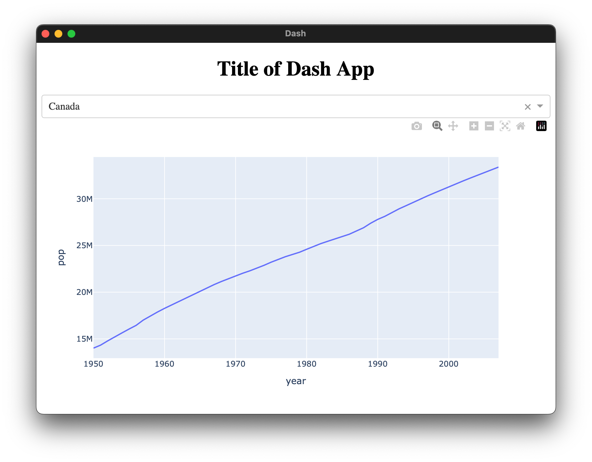

# Dash Standalone Boilerplate

This package is a template for [Dash](https://dash.plotly.com) (and generally [Flask](https://flask.palletsprojects.com/en/3.0.x/)) based Python web programs that want to be a standalone desktop app rather than a local website.



## Setup

First, [install poetry](https://python-poetry.org/docs/). Then:

```bash
# set up project
poetry install
# run the project
poetry run python src/dnb/main.py
```

## How does it work?

First, a [Flask](https://flask.palletsprojects.com/en/3.0.x/) server is opened through a local port (8050). This server can be accessed through any local web browser. [Dash](https://dash.plotly.com) is attached to the Flask server.

To make it a standalone app, a web view (through [pywebview](https://pywebview.flowrl.com)) is opened to visit the address. In contrast to something like Electron, the web view is completely native and thus not included in the final app bundle. This makes the app leaner and less RAM intensive.

Finally, the app is bundled into an executable using [Nuitka](https://nuitka.net). Nuitka compiles the whole python interpreter, including required packages, into an app that can be run without an existing python installation.

These tricks combine to make an app that behaves just as one would expect from a normal app, avoiding the myriad issues that are normally associated with shipping a python web app.

## Building and shipping the app

It is possible to build the app for the prevailing operating system using the following code:

```
# You need to install with nuitka
poetry install -E nuitka
# compile binary
poetry run python -m nuitka --output-dir=build --onefile --macos-create-app-bundle --include-package-data=dash --include-package-data=dash_core_components --include-package-data=dash_html_components --include-package-data=packaging --include-package=plotly --include-package-data=plotly --include-package-data=dnb src/dnb/main.py
# run binary
./main.bin
```

This repository also comes with a [github action](https://docs.github.com/en/actions) that builds it for macOS, Linux, and Windows. This action takes about 2 hours to execute, using about 360 of your [2000 free minutes](https://docs.github.com/en/billing/managing-billing-for-github-actions/about-billing-for-github-action) offered by GitHub - so use it sparingly. To trigger it, tag a commit as release:

```
git tag release.0.1
git push --tags
```

You will be able to download the artifacts of the build from the workflow page. I recommend publishing them locally on GitHub with the [Releases](https://docs.github.com/en/repositories/releasing-projects-on-github/managing-releases-in-a-repository) feature. Note that the macOS and Linux builds are not executable by default. Before uploading, make sure you `chmod +x path/to/executable` and re-zip the application.

## Alternatives

There are a few alternatives to using Nuitka to create binaries:
- Some (like [PyApp](https://ofek.dev/pyapp/latest/), [pyinstaller](https://pyinstaller.org/en/stable/) and [PyOxidizer](https://pyoxidizer.readthedocs.io/en/stable/)), bundle an automated setup script. Actual python code is run on target machines, which reduces build times and may avoid some issues while introducing others. It will also require the target machine to set up itself.
- [Cython](https://cython.org) has an [embedding option](https://github.com/cython/cython/wiki/EmbeddingCython) that allows it to create executables. Cython can gain considerable speed over Nuitka, but may be more work to get running.

## In the Wild

See how I'm using this template with a more advanced project in [ECG Viewer](https://github.com/Ivorforce/ECG-Viewer/tree/main).
